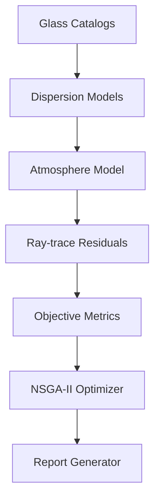

# adc-optimizer  
*Advanced Simulation-Driven Design Toolkit for Atmospheric Dispersion Correctors (ADC)*  

[](LICENSE)  
[](https://www.python.org/)  
[](https://github.com/SonuYadav-IITG/adc-optimizer)  

---

## 🌌 Background  

High-resolution astronomical spectrographs demand **precise atmospheric dispersion correction** to ensure stable, diffraction-limited performance across wide wavelength ranges (350–1800 nm).  

This repository implements an **end-to-end optimization pipeline** for ADC design:  
- Ingesting glass catalogs (Schott, Ohara, CDGM)  
- Modeling atmospheric refraction (Ciddor/Edlén inspired)  
- Simulating prism ray-trace residuals  
- Optimizing with a population-based multi-objective algorithm  
- Generating reproducible reports of top-performing glass pairs  

The toolkit serves both as a **research prototype** and a **design aid** for instruments like **ANDES/ELT**.  

---

## ✨ Features  

- 📖 **Glass catalog ingestion** (CSV → Sellmeier models)  
- 🌍 **Atmosphere model** for dispersion vs. zenith angle  
- 🔬 **Ray-trace heuristics** for prism pairs and ADC residuals  
- 🎯 **Multi-objective optimization** (chromatic RMS, throughput, pupil wobble)  
- ⚡ **Parallel execution** via `joblib`/Dask  
- 🧠 **Optional surrogate modeling** with Gaussian Processes  
- 📊 **Automated reporting** (Markdown summary tables)  
- 🧪 **Unit-tested scaffold**, extensible with Zemax/CodeV validation  

---

## 📐 Workflow  



---

## 🚀 Installation  

```bash
# clone the repo
git clone https://github.com/SonuYadav-IITG/adc-optimizer.git
cd adc-optimizer

# create environment
python -m venv .venv
source .venv/bin/activate

# install dependencies
pip install -r requirements.txt
```

---

## ▶️ Usage  

1. Edit the YAML configs under `config/`:  
   - `site.yaml` → observatory pressure, temperature, humidity, wavelengths  
   - `optimize.yaml` → optimizer settings, glass catalogs  

2. Run the optimizer:  

```bash
python -m adcopt.cli     --site config/site.yaml     --optimize config/optimize.yaml     --out results/adc_report.md
```

3. Open the Markdown report in `results/`.  

---

## 📊 Example Output  

| rank | glass1 | glass2 | chromatic_rms_arcsec | pupil_wobble_arcsec | throughput_loss |
|------|--------|--------|-----------------------|---------------------|-----------------|
| 1    | BK7    | F2     | 0.120                 | 0.050               | 0.008           |
| 2    | S-FPL53| LAH53  | 0.145                 | 0.061               | 0.008           |

---

## 🛠 Roadmap  

- [ ] Replace heuristic ray-trace with full Zemax/CodeV interface  
- [ ] Integrate Ciddor atmospheric model (full precision)  
- [ ] GPU-accelerated surrogate modeling with GPyTorch  
- [ ] Interactive dashboard (Streamlit) for design space exploration  
- [ ] Publish as PyPI package  

---

## 📖 Citation  

If you use `adc-optimizer` in academic work, please cite:  

```bibtex
@misc{adc-optimizer,
  author       = {Sonu Yadav},
  title        = {adc-optimizer: End-to-end Workflow for Atmospheric Dispersion Corrector Design},
  year         = {2025},
  publisher    = {GitHub},
  journal      = {GitHub repository},
  howpublished = {\url{https://github.com/SonuYadav-IITG/adc-optimizer}}
}
```

---

## 📜 License  

This project is released under the [MIT License](LICENSE).  

---

## 🤝 Contributing  

Pull requests are welcome! Please open an issue first to discuss what you’d like to change.  

---

🔥 With this scaffold, you can start **serious ADC design exploration** today, and extend it with lab validation or full ray-tracing integration tomorrow.  
